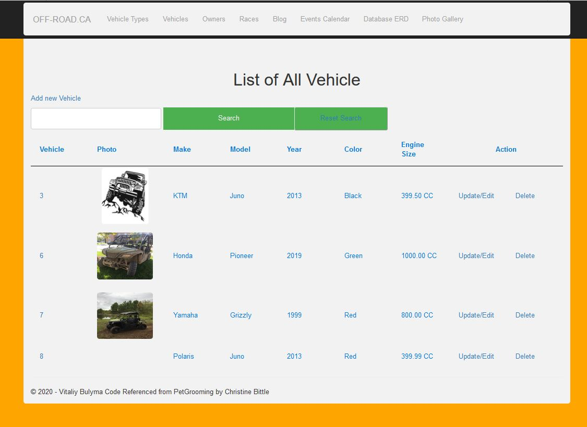
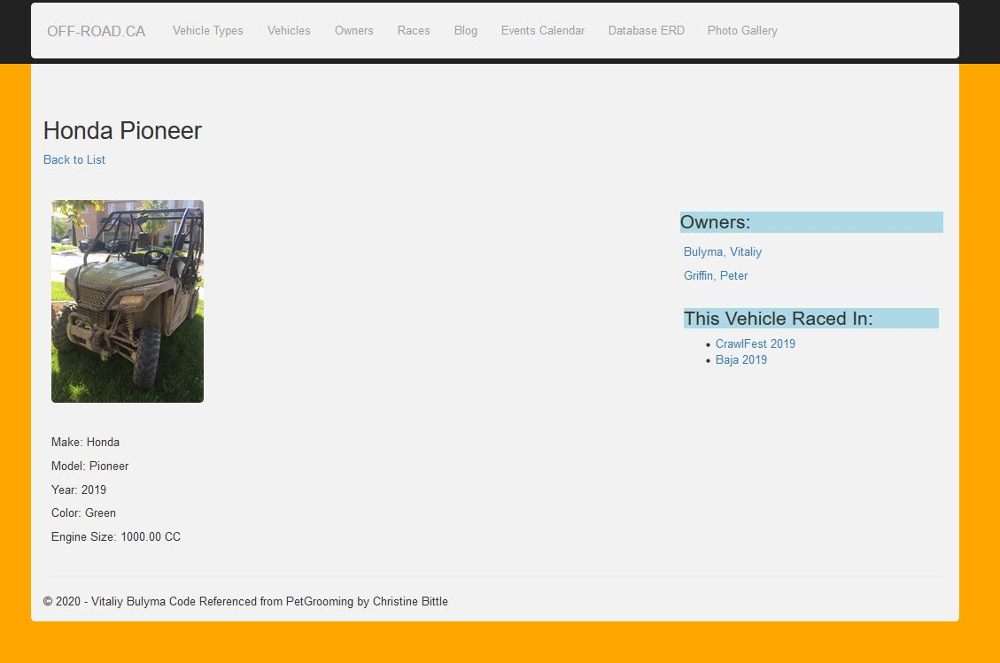
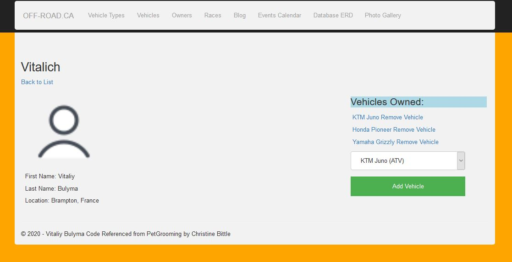

# Off-Road.ca

In this project I implemented MVC information design patterns, using .NET framework to create
an app which allows users to add themselves to the system, add thier vehicle, and register for the event from the list of events.

